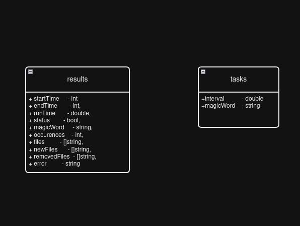

## Deploying/Running the API in Docker (EASY)

Requirements:
1. [Docker](https://docs.docker.com/get-docker/)
2. [Docker compose](https://docs.docker.com/compose/install/)

Run the below command to deploy the api (for os other than Linux, refer respective documentation):

```sh
docker-compose up
```

Once the services are up and running you should see logs from gin saying the server is listening on 8080. Now you can try examples in below section

------------------------------------------------------------------
## Deploying/Running the API in Local (HARD)

Requirements:
1. Go 1.21.5 (or recreate the mod file)
2. MongoDB
3. Redis Server
4. Make any required changes to .env file. See the description of adjusting api parameters

Run the following commands (for os other than Linux, refer respective documentation):

```sh
go mod download && go mod verify

ENV=local go run ./cmd/web
```

Open a new terminal in the same path and start the task worker
```sh
ENV=local go run ./cmd/taskmgr 
```

Once the services are up and running you should see logs from gin saying the server is listening on 8080. Now you can try examples in below section

-----------------------------------------------------------------
## Directory Watcher API Endpoints

#### Response Schema
```js
{
	"success":  bool,	// indicate whether the request was success or not
	"data":     any,		    // results assosciated with successful requests 
	"error":    string     // error messages associated with failed responses
}
```

#### Retreiving the task results

<details>
 <summary><code>GET</code> <code><b>/results</b></code> <code>(retrieves most recent task execution results) </code></summary>

##### Parameters

> | name      |  type     | data type               | description                                                           |
> |-----------|-----------|-------------------------|-----------------------------------------------------------------------|
> | page      |  option | integer >= 1  | Used to paginate the results  |


##### Responses
> | http code     | description 	                                                   					  |
> |--------------|---------------------------------------------------------------------|
> | `200`         | Successful response																  |
> | `400`         | Invalid Request. Check the error message for  details		  |
> | `500`         | Something went wrong with the server								  |

##### Example cURL

> ```js
>  curl http://127.0.0.1:8080/results
> ```

</details>

------------------------------------------------------------------------------------------
#### Retrieving the current task configuration

<details>
 <summary><code>GET</code> <code><b>/task-config</b></code> <code>(Retrieves the current task configuration)</code></summary>

##### Parameters

> None

##### Responses
> | http code     | description 	                                                   					  |
> |--------------|---------------------------------------------------------------------|
> | `200`         | Successful response																  |
> | `500`         | Something went wrong with the server								  |

##### Example cURL

> ```javascript
>  curl http://127.0.0.1:8080/task-config
> ```

</details>

-----------------------------------------------------------------------------------------------

#### Updating task configuration

<details>
 <summary><code>POST</code> <code><b>/task-config</b></code> <code>(Updates the current task configuration)</code></summary>

##### Parameters

> None

##### Body
```json
// content-type: application/json
{
	"interval":  30,
	"magicWord":  "helloworld"
}
```

##### Responses
> | http code     | description 	                                                   					  |
> |--------------|---------------------------------------------------------------------|
> | `200`         | Successful response																  |
> | `400`         | Invalid Request. Check the error message for details			  |
> | `500`         | Something went wrong with the server								  |

##### Example cURL

> ```javascript
>  curl  'http://127.0.0.1:8080/task-config' -H 'Content-Type: application/json' --data '{"interval": 30,"magicWord": "helloworld"}'
> ```

</details>

-----------------------------------------------------------------------

#### Retrieving the current task configuration

<details>
 <summary><code>GET</code> <code><b>/trigger</b></code> <code>(Manually triggers a task)</code></summary>

##### Parameters

> None

##### Responses
> | http code     | description 	                                                   					  |
> |--------------|---------------------------------------------------------------------|
> | `200`         | Successful response																  |
> | `500`         | Something went wrong with the server								  |

##### Example cURL

> ```javascript
>  curl http://127.0.0.1:8080/trigger
> ```

</details>


## Configuring the API Parameters

Edit the .env.docker file for modifying the parameters for docker-compose

Edit the .env file for local deployments.

| Param                 | Example           | Description                           |
|-----------------------|-------------------|---------------------------------------|
|REDIS_ADDR             |redis:6379         | Redis server address                  |
|MONGO_URI              |mongodb://db:27017 | MongoDB address                       |
|MONGO_DB               |dirwatcher         | MongoDB database name                 |
|DEFAULT_TASK_INTERVAL  |30                 | Default task interval to use          |
|DEFAULT_SEARCH_STRING  |hello              | Default search string to use          |
|WATCHDIR               |/code/target/      | Path to watch for changes             |
|PAGINATION_SIZE        |10                 | Default pagination size for /results  |
|TASKMGR_SYNC_INTERVAL  |1s                 | Sync interval for task manager        |
|API_ADDR               |:8080              | API bind adddress                     |

## Database Schema

